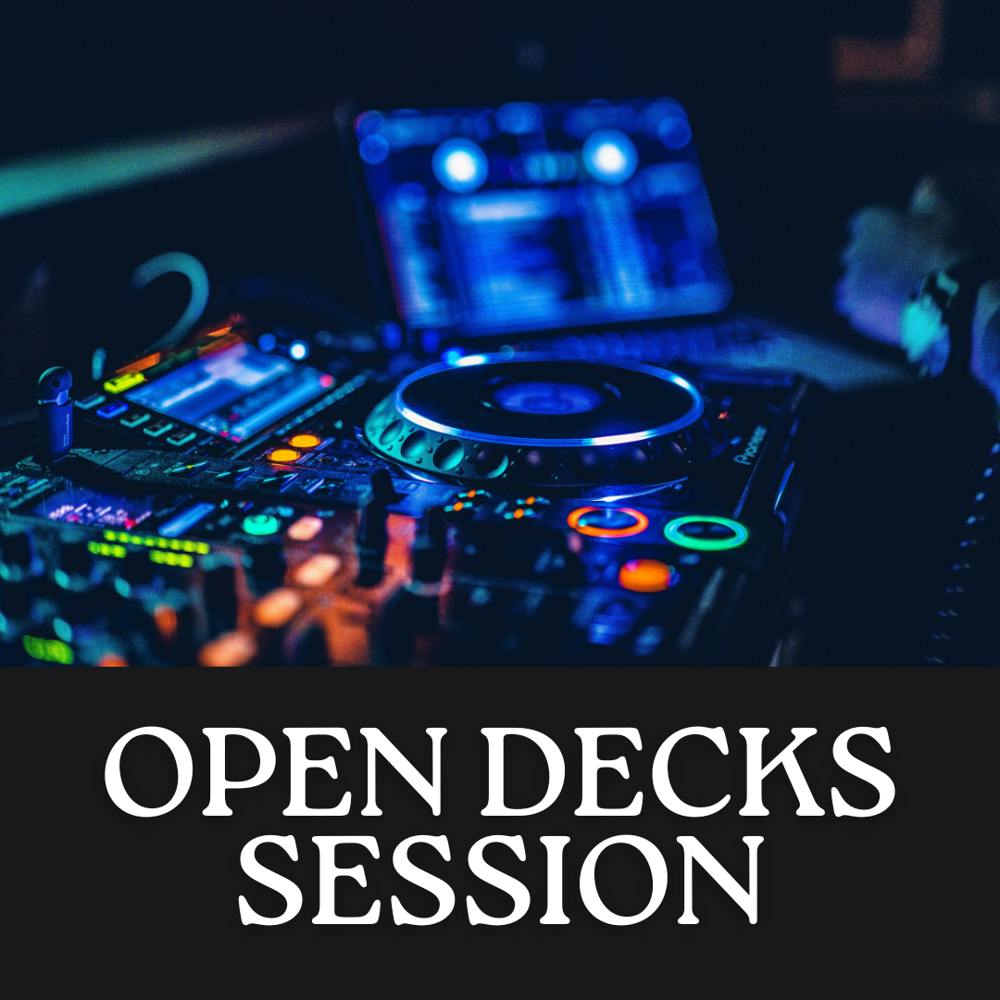

## Calling all musicians!

Attention all aspiring musicians! It is a pleasure to announce that we are holding an Open deck
session in Brighton. Have you been looking for an opportunity to showcase your talents and get your
music out there? Well, here's your chance! An open deck live music event is here in Brighton's most
iconic underground venue The Volks Nightclub, and you don't want to miss it! This event is open to .

We know and understand what it takes and the struggles you must go through just to get on stage and
this is the reason why we do what we do, the stage is yours for the taking.

### Brighton's legendary underground nightclub

The venue for this event is none other than Brighton's legendary underground Volks nightclub. This
venue has been the go-to spot for music lovers for years, and it's not hard to see why. The
atmosphere is electric, open till 7am on the weekends and holds other amazing events such as the

<!-- { width=300px, height:300px } -->
<a href="/open-decks">
<button >Sign Up! </Button>
</a>

<table border="0">
 <tr>
    <td><b style="font-size:30px">Title</b></td>
    <td><b style="font-size:30px">Title 2</b></td>
 </tr>
 <tr>
    <td>Lorem ipsum ...</td>
    <td>Lorem ipsum ...</td>
 </tr>
</table>

 <!-- <iframe
    width="640"
    height="480"
    src="https://www.youtube.com/watch?v=FhsuRZh3sQg"
    frameborder="0"
    allow="autoplay; encrypted-media"
    allowfullscreen
> 
</iframe> -->
